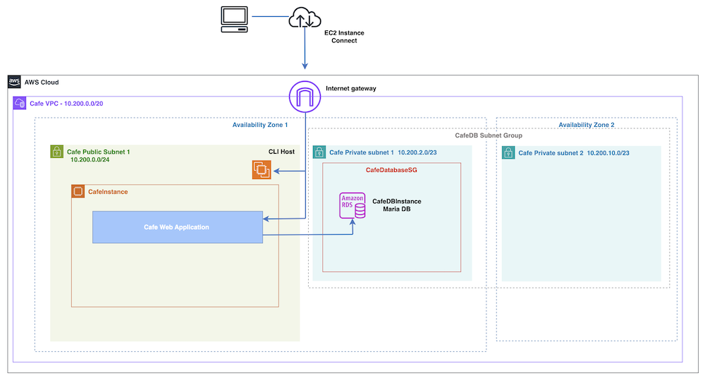

# AWS Amazon RDS Migration using AWS ClI

A hands-on AWS project focused on migrating a MariaDB database from an EC2 instance to Amazon RDS using AWS CLI. The project ensures enhanced scalability, reliability, and performance while minimizing downtime. It also incorporates monitoring through Amazon CloudWatch metrics.

## Project Description

In this project, I created an Amazon RDS MariaDB instance using AWS CLI. I then migrated data from a MariaDB database hosted on an EC2 instance running Linux, Apache, MySQL, and PHP (LAMP) to the newly created RDS instance. Finally, I monitored the RDS instance using Amazon CloudWatch metrics.

This structured approach ensures an efficient and secure migration while leveraging AWS services to optimize database performance and reliability.

## Architecture Overview

### Architecture Before Migration:

### Architecture After Migration:

## Technologies Used

- **AWS RDS (Relational Database Service)**: Managed database service for scalability and performance.
- **AWS EC2 (Elastic Compute Cloud)**: Source database host, accessed via Instance Connect.
- **AWS CloudWatch**: Monitoring solution for tracking database performance.
- **AWS System Manager (Parameter Store)**: Secure storage for sensitive database credentials.
- **MySQL (MariaDB)**: The database engine used for migration.
- **app.diagrams.net**: Architecture design visualization tool.

## Complete Project

## Acknowledgments

- AWS re/Start / Factoría F5 mentoring
- AWS Documentation and Best Practices
- Open source tools that make database migrations possible
